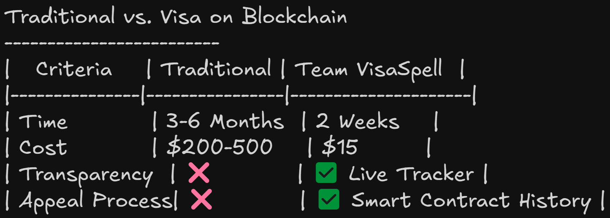
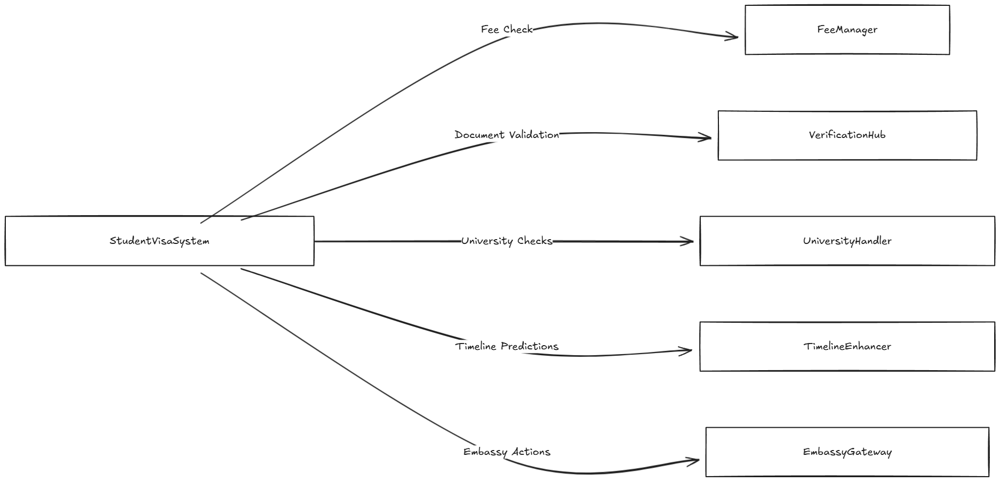

# Chapter 1: Introduction

## 1.1 Background

In recent years, the process of acquiring a student visa has grown increasingly complex. Governments, universities, and embassies rely on extensive documentation and strict verification to ensure the legitimacy of applicants and the authenticity of their credentials. However, traditional visa application workflows often involve multiple intermediaries, lengthy paper-based submissions, and minimal transparency. As a result, students experience uncertainty, embassies manage cumbersome manual checks, and universities struggle to verify documents efficiently.

Meanwhile, blockchain technology has matured beyond the realm of cryptocurrencies. Smart contracts—self-executing agreements on decentralized networks—offer tamper-proof, transparent, and automated execution of predefined conditions. These capabilities present an opportunity to streamline bureaucratic processes such as student visa applications. By recording application data and transactions on-chain, stakeholders (students, universities, embassies, verifiers) can trust the system’s integrity without depending on centralized intermediaries.

With the rise of advanced features like Zero-Knowledge Proofs (ZKPs) and decentralized storage solutions (such as IPFS), blockchain-based systems can facilitate secure document uploads, real-time tracking, and automated verification. These features address many pain points found in traditional visa processes—long approval times, opaque rejections, and risks of forged documentation. In this context, our **Student Visa System** project was developed from scratch, integrating multiple smart contracts and a modern frontend to create a seamless, role-based application process.

> **Note:** The appended Excalidraw diagrams provide a visual representation of our idealized workflow. They contrast the traditional process with our automated approach and illustrate how each smart contract interacts. Some features in the diagrams represent planned or enhanced functionalities that may be implemented in future iterations.

### System Comparisons:

<em>Figure 1.1</em>: System Comparison 

## 1.2 Problem Statement

Despite rapid advancements in digital technologies, the student visa application process in many countries remains fragmented and reliant on outdated paper-based methods. Key issues include:

- **Opaque Application Status:** Applicants lack real-time visibility into the progress of their visa applications.
- **Prolonged Approval Times:** Manual document verification and multi-level reviews lead to significant delays.
- **Potential Fraud:** Paper-based systems are susceptible to forged or tampered documentation.
- **Excessive Intermediaries:** Disconnected processes among universities, embassies, and verification bodies complicate data exchange.
- **Limited Scalability:** The traditional system struggles to meet the demands of a growing international student population.

These challenges highlight the need for a secure, transparent, and efficient solution. A blockchain-based system offers decentralized verification, automated processing, and robust document security to address these issues.

## 1.3 Aim and Objectives

The primary aim of this project is to develop a **Blockchain-Based Student Visa System** that minimizes administrative overhead, enhances transparency, and ensures the authenticity of documents. The key objectives are:

1. **Design a Role-Based Smart Contract Architecture:**  
   Implement distinct roles (Admin, University, Embassy, Verifier, Student) with clearly defined permissions.

2. **Develop a Secure Document Workflow:**  
   Enable encrypted or hashed document uploads (potentially to IPFS) or on-chain references to guarantee data integrity.

3. **Implement Priority Processing:**  
   Allow applicants to choose different fee tiers (Standard, Expedited, Emergency) with corresponding processing timelines and costs.

4. **Provide Real-Time Tracking:**  
   Create a user-friendly interface that allows applicants to monitor the status of their applications at each stage.

5. **Ensure Credibility and Verification:**  
   Integrate a scoring mechanism to reward timely submissions and accurate verifications, enhancing overall trust.

6. **Promote Scalability and Extensibility:**  
   Structure the system so that it can be easily expanded with features like advanced analytics, decentralized storage, or third-party integration.

## 1.4 Scope of the Project

The project encompasses the following elements:

### Smart Contracts

- **StudentVisaSystem:**  
  The core contract managing applications, fees, credibility scoring, and final approval or rejection.

- **UniversityHandler:**  
  Handles university-specific functions such as program registration and admission validation.

- **EmbassyGateway:**  
  Allows embassies to request additional documents or override application decisions.

- **VerificationHub:**  
  Processes document verification requests and maintains verifier reputation.

- **FeeManager:**  
  Manages fee collection and tracks ETH payments for different priority tiers.

- **TimelineEnhancer:**  
  Generates processing time predictions and success probabilities based on application data.

### Frontend Application

- **Modern Web Interface:**  
  Built using Next.js for an intuitive and responsive UI.
- **Blockchain Interaction:**  
  Integrated with RainbowKit and Wagmi for wallet connectivity and on-chain data retrieval.

### User Roles

- **Student:**  
  Creates applications, uploads documents, and monitors application status.
- **University:**  
  Validates academic records and admission letters.
- **Embassy:**  
  Reviews documents and approves or rejects applications.
- **Verifier:**  
  Conducts document verification and updates applicant credibility.
- **Admin:**  
  Manages system configuration, role assignments, and fee withdrawals.

### Security and Verification

- **Access Control:**  
  Smart contracts enforce role-based permissions to ensure that only authorized parties can perform certain actions.
- **Document Authenticity:**  
  Uses cryptographic hashes and on-chain storage to secure document references.

### Deployment

- **Test Network Deployment:**  
  The system is deployed on the Scroll Sepolia test network, with potential for mainnet deployment in future iterations.

### Smart Contracts Flow-Diagram

<em>Figure 1.2</em>: Contract Interaction Diagram

*(Refer to the appended flow diagrams for a detailed visual overview of how the core contract communicates with the modules like FeeManager, VerificationHub, and UniversityHandler.)*

## 1.5 Significance of the Study

This project is significant for several reasons:

- **Process Efficiency:**  
  Automating checks and centralizing data on the blockchain reduces administrative overhead for embassies and universities.
  
- **Enhanced Transparency:**  
  Applicants gain real-time visibility into their visa application status, reducing uncertainty and frustration.
  
- **Fraud Mitigation:**  
  On-chain storage of document references and the use of cryptographic proofs help prevent forgery and unauthorized tampering.
  
- **Cost-Effectiveness:**  
  Streamlining the process can lower overall costs, reducing fees and processing times.
  
- **Scalability:**  
  The modular architecture allows for future enhancements such as IPFS-based storage, zero-knowledge proofs, or advanced analytics.
  
- **External Recognition:**  
  Our project has been recognized in competitive forums, notably winning the 3rd prize at the Eth Uprising Hackathon. This acknowledgment underscores the innovation and practical value of our approach.

## 1.6 Methodology Overview

The project follows an iterative development model, summarized as follows:

1. **Requirement Gathering:**  
   Identification of user roles, pain points, and solution requirements through literature review and domain analysis.

2. **Smart Contract Development:**  
   Design, coding, and rigorous testing of multiple Solidity contracts to ensure security and clarity of logic.

3. **Frontend Integration:**  
   Development of a user-friendly Next.js interface that interacts with the blockchain using Wagmi and RainbowKit.

4. **Testing & Refinement:**  
   Conducting unit, integration, and user acceptance tests, with continuous performance tuning and gas optimization.

5. **Deployment & Demonstration:**  
   Deploying the contracts to a test network (Scroll Sepolia) for real-time demonstration and iterative feedback. Future plans include integration with The Graph and IPFS for enhanced off-chain data indexing and document storage.

### Traditional vs Blockchain Approach

<em>Figure 1.3</em>: Traditional vs. Blockchain Visa Process Flow

*(The appended flow diagrams provide a visual comparison between the conventional visa application process and the automated, blockchain-based approach implemented in our project.)*

## 1.7 Organization of the Report

The remainder of this document is organized as follows:

- **Chapter 2: Literature Review**  
  An in-depth survey of related work on blockchain-based e-governance, decentralized identity, and similar systems.

- **Chapter 3: Research Methodology**  
  A detailed explanation of the iterative development process, testing frameworks, and data collection methods employed in this project.

- **Chapter 4: System Design**  
  An overview of the system’s architecture, including UML diagrams, data flow diagrams, and smart contract interactions.

- **Chapter 5: System Development**  
  A comprehensive account of the development process, including code structure, contract implementation, and frontend integration.

- **Chapter 6: Testing and Evaluation**  
  An overview of the test plans, performance metrics, and user feedback that guided the refinement of the system.

- **Chapter 7: Conclusion**  
  A summary of the project’s key findings, limitations, and recommendations for future work.

---

*End of Chapter 1*

