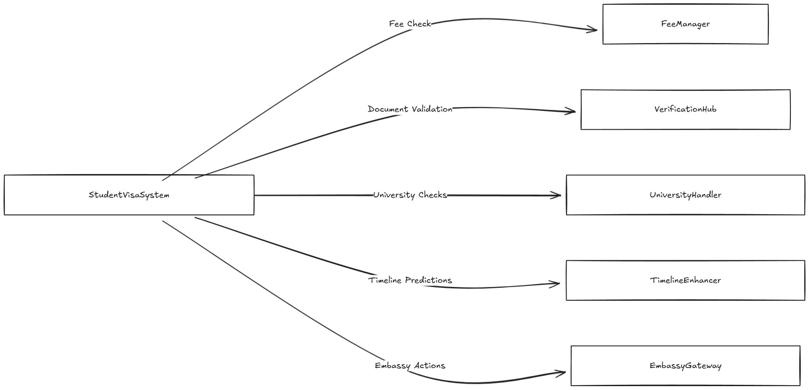
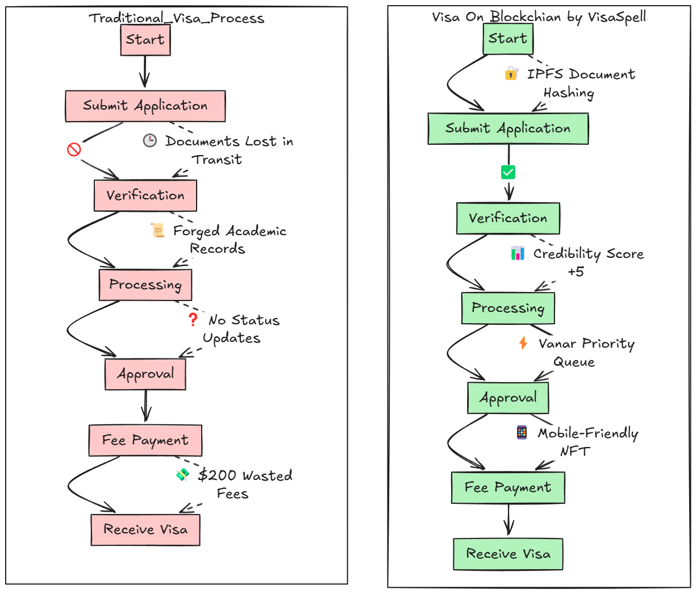
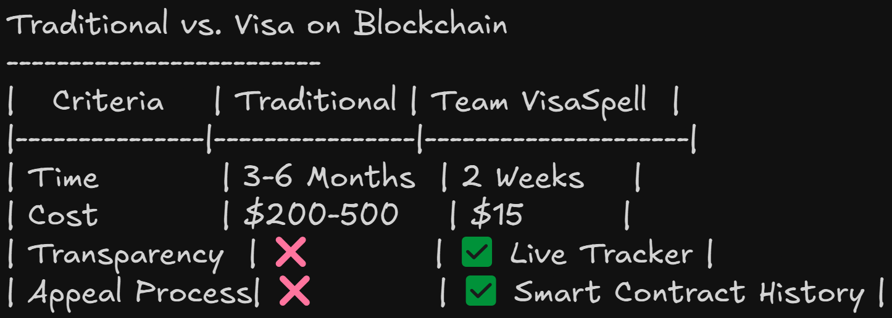

# Blockchain-Based Student Visa System

[](https://soliditylang.org)
[](https://getfoundry.sh)
[](https://opensource.org/licenses/MIT)
[](https://scroll.io)

A decentralized application for managing student visa applications using blockchain technology, featuring document verification, priority processing, and credibility scoring.

## Features

- 🛡️ Role-based access control for universities, embassies, and verifiers
- 📄 Immutable document tracking with expiration dates
- ⚡ Tiered processing priorities (Standard/Expedited/Emergency)
- 📈 Credibility scoring system for applicants
- 🔗 Decentralized verification ecosystem
- ⏳ Automated timeline predictions
- 💰 Flexible fee management with multiple payment options

## Technology Stack

- **Smart Contracts**: Solidity 0.8.20
- **Development Framework**: Foundry
- **Security**: OpenZeppelin Contracts
- **Testing**: Forge with Solidity tests
- **Network**: Ethereum Sepolia, Scroll Sepolia Testnet and Vanguard Vanar Sepolia

## Deployed Contracts (Ethereum Sepolia)

# deployed on Anvil

== Return ==
svs: contract StudentVisaSystem 0x5FbDB2315678afecb367f032d93F642f64180aa3
embassyGateway: contract EmbassyGateway 0x5FC8d32690cc91D4c39d9d3abcBD16989F875707
feeManager: contract FeeManager 0xe7f1725E7734CE288F8367e1Bb143E90bb3F0512
timelineEnhancer: contract TimelineEnhancer 0xDc64a140Aa3E981100a9becA4E685f962f0cF6C9
universityHandler: contract UniversityHandler 0xCf7Ed3AccA5a467e9e704C703E8D87F634fB0Fc9
verificationHub: contract VerificationHub 0x9fE46736679d2D9a65F0992F2272dE9f3c7fa6e0

== Logs ==
  Deployment complete. Contract addresses:
  StudentVisaSystem: 0x5FbDB2315678afecb367f032d93F642f64180aa3
  EmbassyGateway: 0x5FC8d32690cc91D4c39d9d3abcBD16989F875707
  FeeManager: 0xe7f1725E7734CE288F8367e1Bb143E90bb3F0512
  TimelineEnhancer: 0xDc64a140Aa3E981100a9becA4E685f962f0cF6C9
  UniversityHandler: 0xCf7Ed3AccA5a467e9e704C703E8D87F634fB0Fc9
  VerificationHub: 0x9fE46736679d2D9a65F0992F2272dE9f3c7fa6e0


All contracts are verified on Ethereum Sepolia Testnet:

0: contract StudentVisaSystem 0xE57f598BaA132F479862eC7b9AA52E792E3282A7
1: contract EmbassyGateway 0x611646DE9FF0615249652939E3ee2813D35Eca10
2: contract FeeManager 0x6Ad58B6725D603f593b201b1cd3B760Be6e1d235
3: contract TimelineEnhancer 0xe492a1868F986255E8de329B77d9beFEAD320D90
4: contract UniversityHandler 0x024a9f709e15F9Bd0B4a1535E1c4a740dCa8893D
5: contract VerificationHub 0x2b5DF1B6BD26602188497D8F13C45A79932d2a4f

- **StudentVisaSystem**: [`0xbe051893Ba4E05E57daF9D0e822aE09D9c811D03`](https://sepolia.etherscan.io/address/0xbe051893Ba4E05E57daF9D0e822aE09D9c811D03#code)
- **TimelineEnhancer**: [`0xE0dd9085B5452D220178f967179eCa78d061318c`](https://sepolia.etherscan.io/address/0xE0dd9085B5452D220178f967179eCa78d061318c#code)
- **FeeManager**: [`0x40303B667032BBEBb4724768aDeC268F19Fd9aa2`](https://sepolia.etherscan.io/address/0x40303B667032BBEBb4724768aDeC268F19Fd9aa2#code)
- **VerificationHub**: [`0xCB672d850aCB76f2f089672F69e29e7Eb4B45D0f`](https://sepolia.etherscan.io/address/0xCB672d850aCB76f2f089672F69e29e7Eb4B45D0f#code)
- **UniversityHandler**: [`0xFCcc2684f64F9814835796D34cFf0aEE2b33A555`](https://sepolia.etherscan.io/address/0xFCcc2684f64F9814835796D34cFf0aEE2b33A555#code)
- **EmbassyGateway**: [`0xD2b5E14f7242c45eA6596fc43cee0d016f61923a`](https://sepolia.etherscan.io/address/0xD2b5E14f7242c45eA6596fc43cee0d016f61923a#code)


## Deployed Contracts (Scroll Sepolia)

All contracts are verified on Scroll Sepolia Testnet:

- **StudentVisaSystem**: [`0xEb9eB1Dd3fa0333bea7B4Fa053Eb9557e55FDa74`](https://sepolia.scrollscan.com/address/0xEb9eB1Dd3fa0333bea7B4Fa053Eb9557e55FDa74#code)
- **TimelineEnhancer**: [`0xA9e58d307B8A2125F38d47a570653AbA1765A851`](https://sepolia.scrollscan.com/address/0xA9e58d307B8A2125F38d47a570653AbA1765A851#code)
- **FeeManager**: [`0x29D8A21C5288F9bd6E8221443f06D57665a53219`](https://sepolia.scrollscan.com/address/0x29D8A21C5288F9bd6E8221443f06D57665a53219#code)
- **VerificationHub**: [`0x1ac4e8896b044FC61c4B0D3b0456591A3C1c6a49`](https://sepolia.scrollscan.com/address/0x1ac4e8896b044FC61c4B0D3b0456591A3C1c6a49#code)
- **UniversityHandler**: [`0xEC049424385BC993DdBFc0B66B589C7007f4b383`](https://sepolia.scrollscan.com/address/0xEC049424385BC993DdBFc0B66B589C7007f4b383#code)
- **EmbassyGateway**: [`0x444FC16EA2d53f46d68FB833eB62e1E24539f2d6`](https://sepolia.scrollscan.com/address/0x444FC16EA2d53f46d68FB833eB62e1E24539f2d6#code)

## Deployed Contracts (Vanguard Vanar)

All contracts are verified on Vanguard Vanar Testnet:

- **StudentVisaSystem**: [`0xf342E9e0995d9677784DD57E876C0B10f89C0593`](https://sepolia.scrollscan.com/address/0xEb9eB1Dd3fa0333bea7B4Fa053Eb9557e55FDa74#code)
- **TimelineEnhancer**: [`0x726aa5Da660580044852767712b7D631ef52F8c3`](https://sepolia.scrollscan.com/address/0xA9e58d307B8A2125F38d47a570653AbA1765A851#code)
- **FeeManager**: [`0xFaA35f474b695dDd8823864754C56fB566EFb90d`](https://sepolia.scrollscan.com/address/0x29D8A21C5288F9bd6E8221443f06D57665a53219#code)
- **VerificationHub**: [`0xA986c0dd5b9DFD3a6bb975579718641F24CF74De`](https://sepolia.scrollscan.com/address/0x1ac4e8896b044FC61c4B0D3b0456591A3C1c6a49#code)
- **UniversityHandler**: [`0x44e7f3652100B93db0c8749d173fB3F71Aad9907`](https://sepolia.scrollscan.com/address/0xEC049424385BC993DdBFc0B66B589C7007f4b383#code)
- **EmbassyGateway**: [`0xE927A3cE99bBc0204B10Dd81F99e13354a70016D`](https://sepolia.scrollscan.com/address/0x444FC16EA2d53f46d68FB833eB62e1E24539f2d6#code)

## Note 
> ⚠️ Because of multiple contracts and dependencies vanguard is not supporting to verify the contracts. I've tried multiple ways like from foundry to sourcify, manual, with flattened file with correct inputs still not verified.
  
### Smart Contracts Flow-Diagram


### Traditional vs Blockchain Approach


### System Comparisons


## Installation

1. Clone the repository:
```bash
git clone https://github.com/Akash-Kolekar/VisaSpell.git
cd student-visa-system
```


2. Install Foundry:
```bash
curl -L https://foundry.paradigm.xyz | bash
foundryup
```

3. Install dependencies:
```bash
forge install
```

## Configuration

1. Set up environment variables:
```bash
cp .env.example .env
```

2. Update `.env` with your values:
```
PRIVATE_KEY=your_private_key
SCROLL_SEPOLIA_RPC_URL=your_scroll_rpc_url
VANGUARD_RPC_URL=your_vanguard_rpc_url
ETHERSCAN_API_KEY=your_api_key
```

## Testing

Run the test suite:
```bash
forge test
```

Run with verbosity:
```bash
forge test -vvv
```

## Deployment

Deploy to Scroll Sepolia:
```bash
forge script script/Deploy.s.sol:Deploy --rpc-url $SCROLL_SEPOLIA_RPC_URL --broadcast --verify
```

Deploy to Vanguard:
```bash
forge script script/Deploy.s.sol:Deploy --rpc-url $VANGUARD_RPC_URL --broadcast
```

## Usage

1. **For Students**:
   - Submit visa applications
   - Upload required documents
   - Track application status
   - Pay processing fees

2. **For Universities**:
   - Verify student enrollment
   - Issue acceptance letters
   - Manage student records

3. **For Embassies**:
   - Process visa applications
   - Verify submitted documents
   - Update application status

## Contributing

1. Fork the repository
2. Create your feature branch (`git checkout -b feature/AmazingFeature`)
3. Commit your changes (`git commit -m 'Add some AmazingFeature'`)
4. Push to the branch (`git push origin feature/AmazingFeature`)
5. Open a Pull Request


